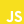

<h1 align="center">Project Name</h1>

<!-- Table of content-->

 ## Table of content

* [Overview](#overview)
    * [Built With](#built-with)
    * [Built by](#built-by)
* [Features](#features)
* [Contact](#contact)

## Overview

Introduce your projects by taking a screenshot or a gif. Try to tell visitors a story about your project by answering:

- Goal
- why this project
- Where can I see your demo?
- What was your experience?
- What have you learned/improved?
- Your wisdom? :)

### Built with

    
    

### Built by

**Vincent-Risk0**

    

## Features

Explain why you're doing this repo, who you work with, why you're doing it. 

## Contact

Contact from owner.
